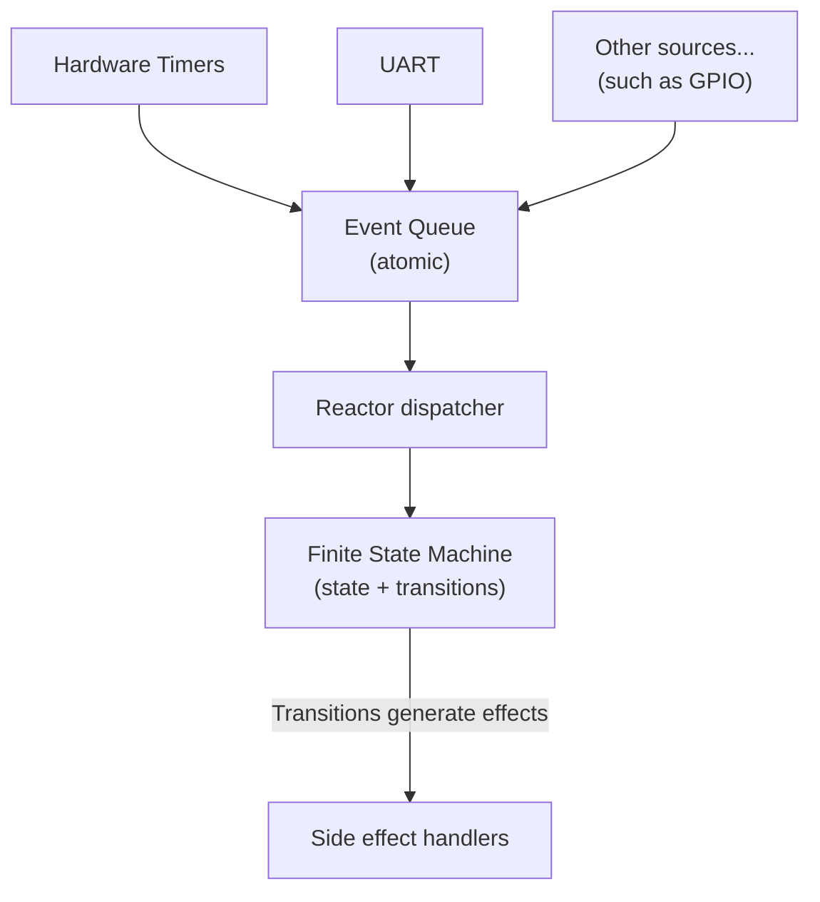

# Embedded Focus Timer

This is a project made during the Winter Break of 2025 in order to practice embedded systems programming. It's built using [ESP-IDF](https://docs.espressif.com/projects/esp-idf/en/stable/get-started/index.html) and [FreeRTOS](https://www.freertos.org/) for the ESP32 platform.

The main goal wasn’t the timer itself, it was practicing architecture and design:

- Finite State Machine for behavior & transitions
- Reactor pattern for event-driven orchestration
- Effects (command messages) to decouple FSM logic from hardware (UART, timers, GPIO, etc.)
- UART for observability + interaction (status output, simple commands)

This makes the core logic portable, unit-testable, and easy to extend to arbitrary step sequences (e.g., long breaks, custom cycles, pauses, etc.) without needing ESP-IDF/FreeRTOS knowledge.

## Links

- [Learning Notes](/docs/learning-notes.md) (lessons learned and cool tricks)
- [Deep dive into architecture](/docs/architecture.md)

## Features

- Two-step cycle: Work → Rest
- Event-driven (no busy waits in the core logic)
- FSM is pure/deterministic: `(state, event, now_ms) -> (next_state, effects[])`
- FSM emits effects rather than calling hardware APIs directly
- UART interface for:
  - printing current state / remaining time
  - sending commands (start/stop/reset, optional configuration)
- Extensible timer “program” model (support more steps without rewriting control flow)

## Architecture overview



## How to use

In order to build and flash this project, the [ESP-IDF software development environment](https://docs.espressif.com/projects/esp-idf/en/stable/esp32/get-started/index.html#installation) is required.

Once installed, the following commands can be used to build the image, flash it, and open the serial monitor:

```bash
# (Optionally) clean the build directory
idf.py fullclean

# Build the image
idf.py build

# Flash (Replace PORT)
idf.py -p PORT flash

# Monitor (recommended)
idf.py -p PORT monitor
```

You can also configure ESP32 options with:

```bash
idf.py menuconfig
```
