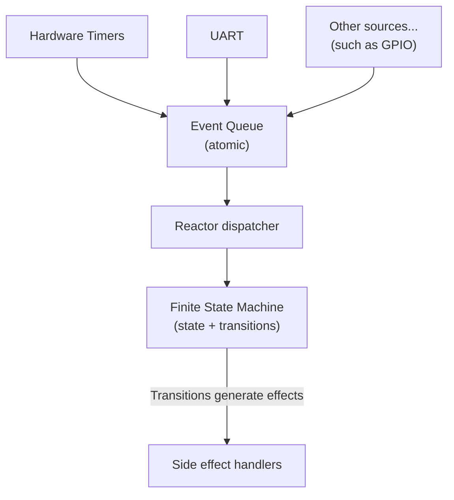
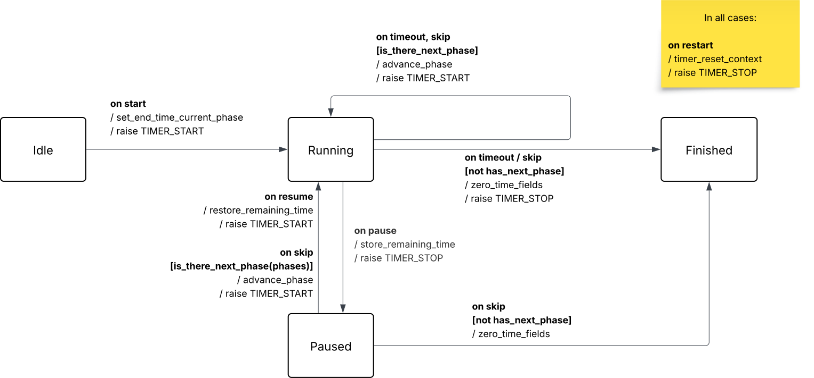

# Architecture

- Finite State Machine (FSM) (business logic)
  - In charge of ensuring correctness
  - States protect invariants
  - Input: events (START, PAUSE, RESUME, TIMEOUT, etc.)
  - Output: next state + a list of effects
- Event emitting tasks
  - Hardware Timers, UART, etc.
  - Converts hardware happenings into events
  - The events are sent to the reactor's event queue
  - They are naturally asynchronous and typically run as FreeRTOS tasks.
- Reactor (orchestrator)
  - It synchronously processes the events in its event queue and applies them to the FSM
  - Calls the effect handlers by passing them the list of effects.

This separation keeps the FSM pure: hardware inputs become events, and hardware interactions happen only through effects handled by the platform layer. That makes the logic easily testable and highly portable.

## State diagram

## States and invariances

- IDLE
  - timer stopped
  - all member values zeroed
  - `phase_index = 0`
- RUNNING
  - timer armed
  - `remaining_ms = 0`
- PAUSED
  - timer stopped
  - `end_time_ms = 0`
- FINISHED
  - timer stopped
  - all timing fields zeroed
  - `has_next_phase == false` 
